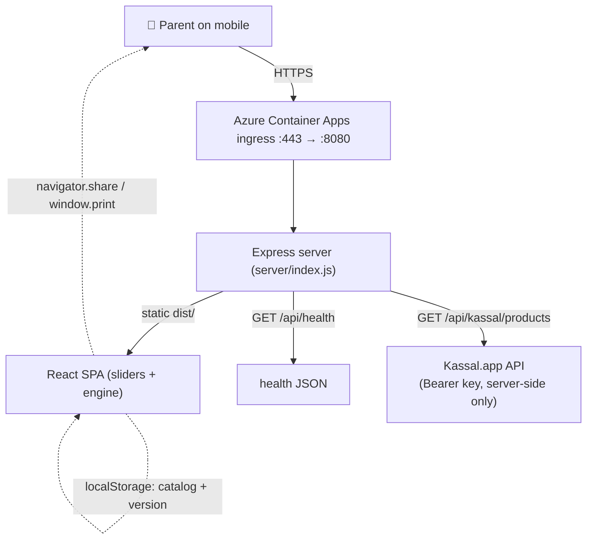

# Architecture

## Overview

A **single Node.js (Express) service** serves both the static React SPA and a small JSON API.
All party-planning math runs **client-side** in the browser from two slider values — there is no
database and no server-side state. The only reason the server exists (beyond serving files) is to
**proxy the Kassal.app price API** so the API key never reaches the browser, and to expose a health
probe for Azure Container Apps.



## Request flow

1. Browser requests `/` → Express returns `dist/index.html` (pre-built, Norwegian `lang="nb"`, OG tags, JSON-LD, PWA manifest link).
2. The bundled JS boots React, reads the config from the URL query string, loads the goods catalog from `localStorage` (or defaults), and renders the result **instantly** — no network round-trip needed.
3. Slider changes recompute the plan in-memory and update the URL via `history.replaceState`.
4. Optional "Sjekk pris" calls `/api/kassal/products?search=…`; Express adds the `Authorization: Bearer` header and returns a trimmed product list.
5. The service worker caches the shell for offline / repeat use.

## Tech stack

| Layer | Choice | Why |
|-------|--------|-----|
| Server | **Express 4** (ESM) | Tiny, serves static + a couple of routes. Express 4 (not 5) to keep the `app.get('*')` SPA-fallback wildcard. |
| Client | **Vite + React 18 + TypeScript** | Fast builds, small bundle (~54 kB gzip), great DX. |
| Styling | Hand-written CSS (`src/styles.css`) | Mobile-first, no UI framework; custom range sliders, segmented control, sticky action bar, print styles. |
| Prices | **Kassal.app** v1 REST | Real Norwegian grocery prices; key stays server-side. |
| State | URL query string + `localStorage` | Shareable links; persisted custom catalog. No backend state. |
| Build/runtime | **Docker** multi-stage (`node:22-alpine`) | Build with dev deps, run with prod deps only. |
| Hosting | **Azure Container Apps** | Scales, HTTPS ingress, secrets, pulls public image from GHCR. |

## Why client-side calculation

The engine is pure functions over two numbers and a JSON catalog (`computePlan`). Running it in the
browser means: zero latency, works offline, trivially shareable (the URL is the whole state), and the
server can stay stateless and cheap. There is nothing worth a backend round-trip.

## Directory map

```
server/index.js            Express: static dist/ + /api/health + /api/kassal proxy
index.html                 SPA entry (meta, OG, JSON-LD, PWA, lang=nb)
src/
  main.tsx                 React bootstrap + service-worker registration
  App.tsx                  State, URL/localStorage sync, share/print, view switch
  styles.css               Mobile-first design system + print rules
  components/
    Slider.tsx             Range input + stepper buttons
    Controls.tsx           Two sliders, home/barnehage toggle, allergy chips
    Results.tsx            Grouped shopping list, price lookup, checklist, timeline
    ConfigEditor.tsx       Fully-editable goods catalog
  lib/
    types.ts               GoodItem, PartyConfig, LineItem, enums
    catalog.ts             DEFAULT_CATALOG + CATALOG_VERSION
    engine.ts              bandForAge, computeLineItem, computePlan, suggestedGuests
    checklist.ts           TIMELINE + CHECKLIST + barnehage note
    store.ts               localStorage + URL parse/write + import/export
    kassal.ts              client fetch wrapper for the price proxy
    format.ts              nb-NO number/price formatting
public/                    manifest.webmanifest, sw.js, icon.svg, generated PNG icons, robots.txt
scripts/gen-icons.mjs      dev-only: rasterize icon.svg → PNGs (uses sharp, not a project dep)
Dockerfile                 multi-stage build
.github/workflows/deploy.yml   build → GHCR → Azure Container Apps
```

## Design decisions worth remembering

- **No state on the server.** Everything reproducible from `?gjester=…&alder=…` + the (optional) custom catalog in `localStorage`.
- **The goods catalog is data, not code paths.** Each item declares a calculation `mode`; the engine is generic, so users can add/edit items without touching the engine. See [configuration.md](configuration.md).
- **Icons are pre-generated and committed.** `sharp` is used only by `scripts/gen-icons.mjs` locally and is intentionally **not** a dependency, so the Alpine Docker build never compiles native binaries.
- **The Kassal key is server-only.** The browser calls `/api/kassal/...`; the key is read from `process.env` and injected as a Bearer header by Express.
