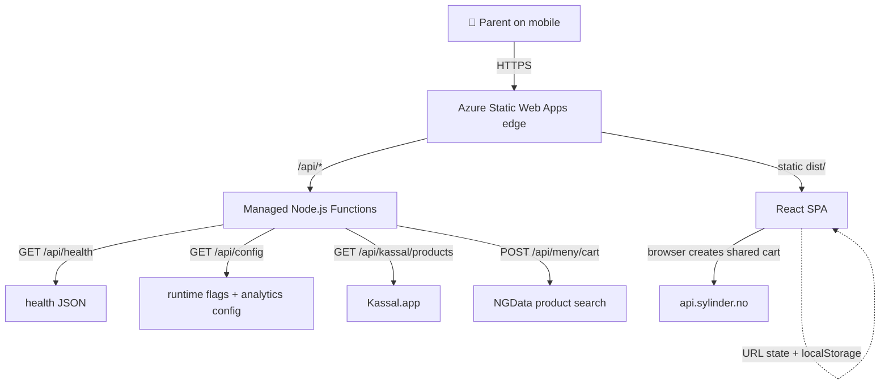

# Architecture

## Overview

**Azure Static Web Apps Free** serves the React SPA, while four managed Node.js HTTP Functions provide
the small JSON API. The app is **wizard-first**: most parents start in a 3-step mobile wizard, while the
advanced controls remain available behind "Hopp over" / "Endre svar".

All party-planning math runs **client-side** from the party config and catalog. There is no database or
server-side state. The managed API exists only for runtime configuration, the secret-bearing
Kassal.app price proxy, health diagnostics, and MENY product resolution.


```mermaid
graph TD
    U["📱 Parent on mobile"] -->|HTTPS| SWA["Azure Static Web Apps edge"]
    SWA -->|"static dist/"| SPA["React SPA"]
    SWA -->|"/api/*"| FN["Managed Node.js Functions"]
    FN -->|"GET /api/health"| H["health JSON"]
    FN -->|"GET /api/config"| C["runtime flags + analytics config"]
    FN -->|"GET /api/kassal/products"| K["Kassal.app"]
    FN -->|"POST /api/meny/cart"| M["NGData product search"]
    SPA -->|"browser creates shared cart"| SYL["api.sylinder.no"]
    SPA -. "URL state + localStorage" .-> SPA
```

## Request flow

1. Static Web Apps returns the pre-built `dist/index.html`. `staticwebapp.config.json` rewrites deep
   content URLs to that file.
2. React starts in the wizard, result, configuration, or content view based on the URL and local state.
3. Config changes recompute the plan in memory and update the query string with
   `history.replaceState`.
4. Optional price lookup calls `/api/kassal/products`; the managed Function authenticates to
   Kassal.app and returns a trimmed product list.
5. The MENY flow asks `/api/meny/cart` to resolve products, then creates the shared cart directly from
   the browser so MENY's per-source-IP rate limit is not shared across all users.
6. The service worker caches static responses for offline and repeat use, but never caches `/api`.

## Tech stack

| Layer | Choice | Why |
|-------|--------|-----|
| API | **Static Web Apps managed Functions** (Node.js 22) | Same-origin `/api`, encrypted runtime settings, and no always-on server. |
| Local adapter | **Express 4** (ESM) | Serves `dist/` and the shared handlers for development, Playwright, and optional Docker fallback. |
| Client | **Vite + React 18 + TypeScript** | Fast builds, small bundle, and a fully client-side calculation engine. |
| Styling | Hand-written CSS (`src/styles.css`) | Mobile-first design, custom controls, and print styles without a UI framework. |
| Prices | **Kassal.app** v1 REST | Real Norwegian grocery prices; the credential stays server-side. |
| State | URL query string + `localStorage` | Shareable links and persisted custom catalog without backend state. |
| Testing | Node test runner + **Playwright** | API behavior plus desktop/mobile browser coverage. |
| Hosting | **Azure Static Web Apps Free** | Global static edge, managed TLS/custom domain, and managed HTTP Functions. |

## Why client-side calculation

The engine is pure functions over the party config and a JSON catalog (`computePlan`). Running it in
the browser means zero calculation latency, offline support, and shareable URL state. Nothing in the
shopping-list calculation needs a backend round-trip.

## Shared API implementation

`api/shared/handlers.cjs` contains framework-neutral response handlers. Azure Functions call them in
production, while `server/index.js` adapts them to Express for local development and E2E. This keeps
validation, cache headers, errors, secret handling, and upstream response mapping identical.

The MENY resolver in `api/shared/meny.cjs` has a 30-second global deadline, below Static Web Apps'
45-second request limit. It keeps successful matches and marks a response as partial when the deadline
prevents all items from completing.

## Directory map

```text
api/
  host.json                Azure Functions host configuration
  shared/
    handlers.cjs           Runtime config, health, Kassal, and MENY HTTP behavior
    meny.cjs               Bounded-concurrency MENY resolver
  config/                  GET /api/config
  health/                  GET /api/health
  kassal-products/         GET /api/kassal/products
  meny-cart/               POST /api/meny/cart
  test/                    API unit tests
server/index.js            Local/E2E Express adapter for dist/ + shared handlers
index.html                 SPA entry, SEO metadata, JSON-LD, PWA links
src/
  main.tsx                 React bootstrap + service-worker registration
  App.tsx                  State, URL/localStorage sync, sharing, and view switch
  styles.css               Tokenised design system + print/reduced-motion
  components/              Wizard, controls, results, editor, footer, MENY dialog
  lib/                     Types, catalog, engine, persistence, API clients, WebMCP
public/
  staticwebapp.config.json SPA fallback, headers, Node.js 22 API runtime
  sw.js                    Offline cache (never caches `/api`)
  manifest.webmanifest     Installable PWA metadata
  icons and social assets
e2e/                       Playwright desktop + mobile specs
Dockerfile                 Optional local compatibility image
infra/                     Static Web App + analytics workbook IaC
.github/workflows/deploy.yml   release gate → Azure Static Web Apps
```

## Design decisions worth remembering

- **No state on the server.** A party is reproducible from the query string plus an optional custom
  catalog in `localStorage`.
- **Wizard-first, result-first.** The default flow asks the high-signal questions, then leads with the
  shopping list; full controls remain available as advanced mode.
- **One catalog model.** `showIf`, `breadKind`, and `audience` keep food choices and adult quantities
  data-driven. Pinata remains a disabled-by-default catalog item.
- **Festfane visual identity.** The warm-paper canvas, berry accent, self-hosted Bricolage/Hanken
  fonts, tabular figures, accessible focus states, and reduced-motion behavior are intentional.
- **Icons are pre-generated and committed.** `sharp` is a local asset-generation tool, not a
  production dependency.
- **Secrets stay in managed API settings.** The browser only calls same-origin `/api`; it never
  receives the Kassal key.
- **MENY cart creation stays in the browser.** Only product resolution runs server-side, avoiding the
  shared-egress-IP rate limit on shared-cart creation.
